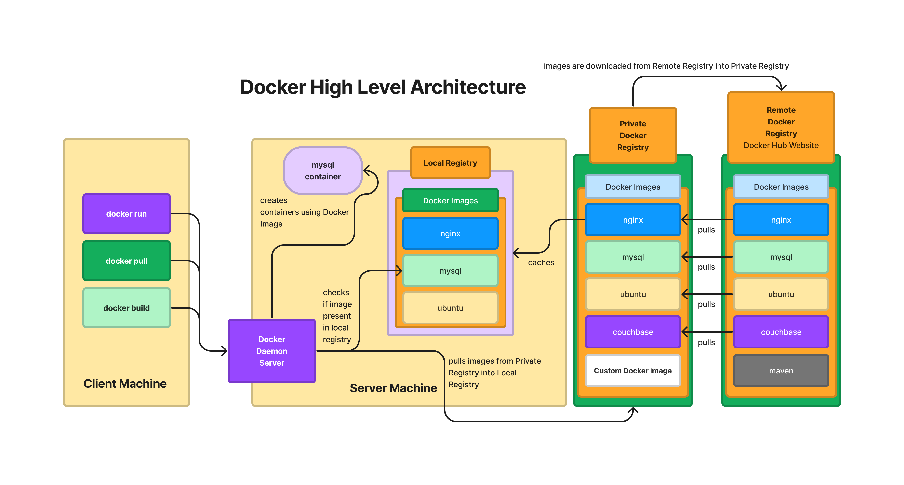

# Day 1

## Info - Bootloader - Multibooting/Dual Booting
<pre>
- Boot loader is a tiny system utility that gets installed in Boot sector of your hard disk
- When the system is booted, the BIOS POST (Power On Self Test completes) and BIOS firmware
  instructs the CPU to run the bootloader at Sector 0, Byte 0 (Boot Sector )
- Once the CPU starts the boot loader system utility, it will scan your system looking for hard disks ( SSD ),
  detecting for all the Operating Systems installed on your machine
- In case, it detects more than one OS, it presents a menu for you to choose between the OS
- Only one OS can be active at any point of time
- Let's say, your laptop has got Windows 11 and Ubuntu 24.04, and you booted your laptop into Windows 11, in order
  to use Ubuntu 24.04, you need to shutdown the Windows 11 OS and boot in Ubuntu 24.04 and vice versa
- examples
  - Boot Camp ( commercial product used in Macbooks to install Windows )
  - LILO 
  - GRUB ( all latest Linux distributions use this )
</pre>
  
## Info - Hypervisor Overview
<pre>
- it is virtualization technology
- with virtualization, we can run multiple OS on the same machine side by side
- i.e more than one OS can actively run in the same laptop/desktop/workstation/server
- there are 2 types of Hypervisor
  1. Type 1 - a.k.a Bare Metal Hypervisor
     - used in Servers & Workstations
     - examples
       - VMWare vSphere(v-center), Linux KVM, Microsoft Hyper-v, zen, etc.,
  2. Type 2 - a.k.a Hosted Hypervisor
     - used in Laptops/Desktops/Workstation where already there is Host OS pre-installed(Windows, Mac OS-X or Linux )
     - examples
       - VMWare Workstation, VMware Fusion, Oracle VirtualBox, Parallel, etc.,
- each VM represents one Operating System with its own OS Kernel
</pre>

## Info - High Level Hypervisor Architecture


## Info - Containerization
<pre>
- is an application virtualization technology
- it is light-weight technology as all containers running on the same Host OS or Guest OS shares the Hardware
  resources on the underlying Host/Guest OS
- container represents an application not an OS
- container doesn't have its own OS Kernel, hence it depends on Host/Guest OS Kernel
- in some ways container and virtual machines behave similar
  - just like a VM has its own virtual network card(s), containers also has its own virtual network card(s)
  - just like a VM gets an IP address, containers also get its own IP address
  - just like a VM has its own software defined network stack, containers also has its own software defined network stack
  - network stack ( 7 OSI Layers )
  - Just like VMs, containers also has a file system ( files & folders )
- but technically comparing a Virtual Machine Guest OS with container is wrong, as Guest OS is a fully functional OS
  with its own Kernel, while container is just an application not a OS, it doesn't have its own OS Kernel
- one container represents one application
- containers will never able to replace OS or Virtualization
- in real world, containers runs inside VMs, VMs runs inside Physical Servers
- Containerization depends on 2 Linux Kernel features
  1. Namespace and
     - is used to isolate one container from the other
  2. Control Groups ( CGroups )
     - is used to apply resource quota restricts like
     - how many CPUs a container can use at the max
     - how much RAM/disk a container can use at the max
</pre>

## Info - High Level Docker Architecture


## Info - Container Engine
<pre>
- Container Engine is a high-level software, that manages container images and containers
- Under the hood, Container Engine depends on Container Runtimes
- Container Engine is user-friendly, it nicely abstract the linux kernel low-level stuffs and provides an easier
  interface to manages images and containers
- examples
  - Docker
    - depends on containerd, which in turn depends on runC container Runtime
  - Podman
    - depends on CRI-O container runtime
</pre>

## Info - Container Runtime
<pre>
- Container Runtime is a low-level software, that manages container images and containers
- they are not so user-friendly, hence end-user almost never use container runtimes
- example
  - runC, cRun, CRI-O, rkt, etc.,
- depends on the Linux Kernel Namespace & CGroups
</pre>

## Info - Container Image
<pre>
- is a blueprint/template of a container
- using Container Image, we can create as many containers as we need
- packages a single application with all its dependent libraries, runtimes, etc.,
- it has unique name and ID
- the ID is a 256-bit Hash
</pre>


## Info - Container
<pre>
- is a running instance of a Container Image
- it has an unique name and ID
- the ID is a 256-bit Hash
- one container represents one application
- in some cases, multiple containers would be required to run a single application
- every container runs in a separate namespace
</pre>


## Info - Container Registry
<pre>
- is a collection of one or more Container Images
- Docker supports 3 types of Registries
  1. Docker Local Registry 
     - is a folder on which all container images are cached ( /var/lib/docker is the folder where local registry is maintained)
  2. Docker Private Registry
     - it is a Server
     - it could be Sonatype Nexus or JFrog Artifactory
  3. Docker Remote Registry ( Docker Hub website )
     - is a website maintained by Docker Inc organization along with opensource community support
</pre>


## Info - Docker Overview
<pre>
- Docker is implemented in Go language by an organization called Docker Inc
- Docker comes in 2 flavours
  1. Docker Community Edition - Docker CE ( opensource )
  2. Docker Enterprise Edition- Docker EE ( licensed product )
</pre>

## Info - Installing Docker in Ubuntu
```
# Add Docker's official GPG key:
sudo apt update
sudo apt install ca-certificates curl
sudo install -m 0755 -d /etc/apt/keyrings
sudo curl -fsSL https://download.docker.com/linux/ubuntu/gpg -o /etc/apt/keyrings/docker.asc
sudo chmod a+r /etc/apt/keyrings/docker.asc

# Add the repository to Apt sources:
sudo tee /etc/apt/sources.list.d/docker.sources <<EOF
Types: deb
URIs: https://download.docker.com/linux/ubuntu
Suites: $(. /etc/os-release && echo "${UBUNTU_CODENAME:-$VERSION_CODENAME}")
Components: stable
Architectures: $(dpkg --print-architecture)
Signed-By: /etc/apt/keyrings/docker.asc
EOF

sudo apt update

sudo apt install -y docker-ce docker-ce-cli containerd.io docker-buildx-plugin docker-compose-plugin

sudo systemctl enable docker
sudo systemctl start docker
sudo usermod -aG docker $USER
newgrp docker
docker --version
docker images
```

## Lab - Checking your docker version and installation details
```
docker --version
docker info
```


## Lab - Listing docker images from your local docker registry
```
id
docker images
# Troubleshooting Permission denied error
newgrp docker
id

docker images
```


## Lab - Download docker image from Docker Hub to your local docker registry
```
docker pull nginx:latest
docker pull mysql:latest
```


List the images from your local docker registry
```
docker images | grep nginx
docker images | grep mysql
```


## Lab - Deleting a docker image from local docker registry
```
# Download hello-world:latest image
docker pull hello-world:latest

# List hello world image
docker images | grep hello-world

# Delete hello world image
docker rmi hello-world:latest

# List hello world image
docker images | grep hello-world
```


## Lab - Creating and running the container in the background(daemon/deattached) mode
```
# Try to navigate to /var/lib/docker folder
whoami
cd /var/lib/docker  # You are supposed to get permission denied error as you are not an administrator

docker run -dit --name ubuntu1-jegan --hostname ubuntu1-jegan ubuntu:latest /bin/bash

# List all running containers
docker ps

# Get inside the container shell
docker exec -it ubuntu1-jegan /bin/bash
hostname
hostname -i
ls
whoami
exit
```


