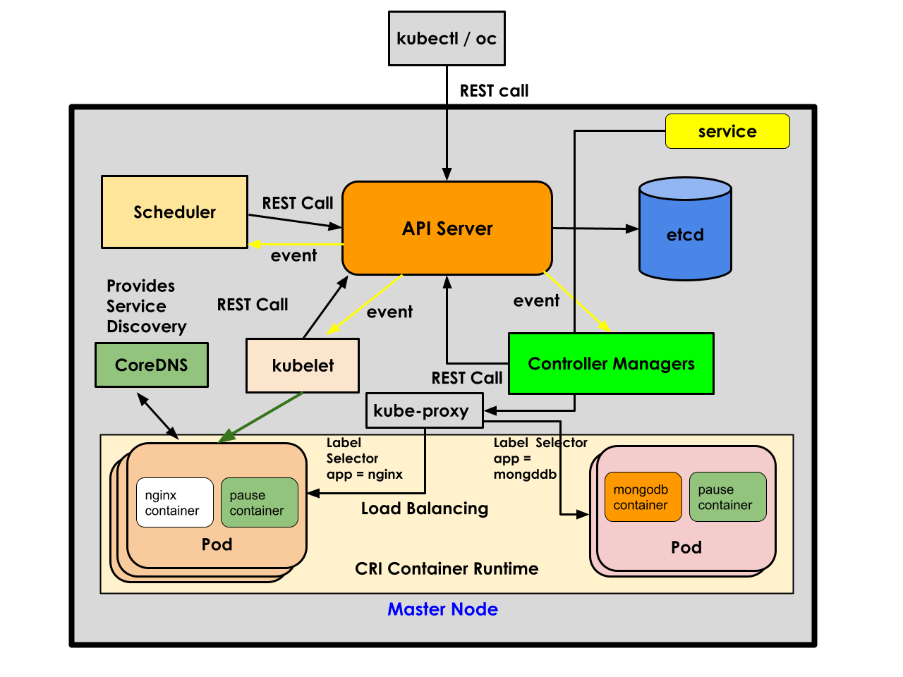

# Day 2

## Info - Container Orchestration Platform Overview
<pre>
- offers in-built features to make your applications high-available (HA)
- it has monitoring features to check whether your application is running, live and ready to server users
- scale up/down is possible when the traffic your application increases/drops down
- rolling update
  - upgrading/downgrading your application version from one to other without any downtime
  - rolling back in case the recently deployed application version is found to be unstable
- in built features to 
  - expose your application for internal access or for external access using services
- supports service discovery
  - accessing an application using its service name
- CI/CD is possible in some container orchestration platforms
- it supports both legacy monolithic applications as well as micro service based applications
- examples
  - Docker SWARM ( opensource )
  - Google Kubernetes ( production grade and opensource )
  - Red Hat Openshift ( it is Red Hat's distribution of Kubernetes )
  - Rancher
  - AWS eks ( AWS Managed Kubernetes cluster )
  - Azure aks ( Azure Managed Kubernetes cluster )
  - AWS ROSA ( AWS Managed Red Hat Openshift cluster )
  - Azure ARO ( Azure Managed Red Hat Openshift cluster )
</pre>

## Info - Kubernetes
<pre>
- it is opensource
- it is command-line tool, there is no production grade webconsole/dashboard
- it is robust and production grade
- it supports many different types of Container Engine and Container Runtimes
- it works as a cluster of many nodes 
- node could be a
  - physical server with some linux os installed on it
  - virtual machine with some linux os installed on it
  - it can be ec2 instance or azure vm with some linux os install on it
  - there are 2 types of nodes
    - master node and
      - Control Plane components will be running
    - worker node
      - this where user application will be running
- it has provides all the basic features required to extend Kubernetes API and/or features
  - Custom Resource Definition and Custom Controller, with this we can any new features and extend Kubernetes
  - Operator => is a combination of many custom resources and custom controller
</pre>

## Info - Red Hat Openshift Overview
<pre>
- it is Red Hat's distribution of Kubernetes 
- it is developed on top of Google opensource Kubernetes
- it is a superset of Kubernetes with many additional useful features
- using Kubernetes Operator, Openshift team has added many additional features
- Openshift 4.x onwards - only supports CRI-O Container Runtime and Podman Container Engine
- Openshift 4.x onwards - the OS that can be installed in master nodes is Red Hat Enterprise Core OS (RHCOS)
- Openshift 4.x onwards - the OS that can be installed in worker nodes is Red Hat Enterprise Core OS (RHCOS) or RHEL
- Red Hat Enterprise Core OS
  - there is highly secured minimal linux operating system
  - this comes with specific version of Podman and CRI-O container runtime pre-installed
  - this works like immutable read-only Operating System with restricted write access
  - this will enforce many best practices
  - certain folders like /bin, /usr, /var, /etc are considered read-only folder, applications
    won't be allowed to modify them, when applications are found to attempt modifying those folders, they won't be
    allowed to run
  - ports below and upto 1024 are reserved for internal use in case of Openshift
- built-in User management is supported (Role based access control supported out of the box )
- built-in Internal Container Registry comes of the box
- New features
  - Route
  - DeploymentConfig
  - Project
  - S2I ( Source to Image )
    - applications can be deployed from source code from version control like Github, bitbucket, etc.,
    - support different strategies
  - BuildConfig, Build
- comes with world-wide support from Red Hat ( an IBM company )
</pre>

## Info - Kubernetes High Level Architecture


## Info - Red Hat Openshift High Level Architecture



## Info - Types of applications supported in Kubernetes/Openshift
<pre>
- Stateless application ( Deployment )
- Stateful appliaction ( StatefulSet )
- one time application that stops after some time ( Job )
- recurring tasks that every on a schedule day, time and once the task completes, it stops running (CronJob)
- there are special purpose applications like (DaemonSet)
  - application that collects performance metrics ( Prometheus - one instance that runs in every node )
  - load-balancing ( kube-proxy pod that runs in every node )
  - dns pods - one dns pod that runs in each node
- BuildConfig & Build (S2I)
  - application can be build and packaged as custom images
</pre>

## Info - Pod
<pre>
- Pod is a logical grouping of related containers
- every Pod has two or more containers
- each Pod represents one application
- in certain case, many Pods together represent one application
- every Pod has atleast 2 containers
  1. application container ( microservice, db server, app server, web server, webservice, REST API, SOAP api )
  2. pause container - secret infra container ( hidden ) - this provider network
- all containers in a Pod shares the same IP address or same network and Ports
- the smallest unit that can be deployed in Kubernetes or Openshift is a Pod
- Pod is Kubernetes/Openshift resource that resides in etcd database
- Pod also can be understand as a JSON/YAML configuration object
</pre>

## Info - ReplicaSet
<pre>
- in case of Stateless application, ReplicaSet Kuberentes/Openshift resource or configuration object captures the below details
  - number of Pods instances that must be created
  - the container image that must be used to create the Pod
- this type of resource is managed by a controller called ReplicaSet Controller
- ReplicaSet Controller is one of the Controller that is part of Controller Managers ( Control Plane Component )
- this is stored and maintained within etcd database by API Server 
- ReplicaSet has one or more Pods
</pre>

## Info - Deployment
<pre>
- this represents a stateless application configuration
- this captures the below details
  - name of the stateless application
  - container image
  - number of pods 
- this resource is created and maintained by API Server within etcd database
- Deployment Controller uses this as an input resource to manage a stateless application
- Deployment has one or more Replicasets
- Deployent will create one Replicaset per Container Image version
</pre>


## Info - Project
<pre>
- In Openshift, there is a feature called Project
- Project is developed on top of Kubernetes Namespace
- Project allows Openshift to apply Role Based Access Control to allow/deny access to users to a project
- a Project may give access to set of users that are part of the team
- each team member, will have an openshift user with different permission
- project is a separate the application deployment by one team from the other teams in the same organization
</pre>


## Info - Control Plane Components in Openshift
<pre>
- Control Plane components runs only in Master nodes
- there are 4 Kubernetes components
  1. API Server
  2. etcd database
  3. Controller Managers
  4. Scheduler
- in case of Openshift, there is a 5th component
  - Openshift API Server
</pre>

## Info - API Server Overview
<pre>
- is the heart of Kubernetes/Openshift
- API server co-ordinates everything in Kubernetes/Openshift
- API Server doesn't anything by itself, it delegates
- the only thing API Server does is, it updates things into etcd database and whenever etcd database is update, it 
  will trigger some events
- the events notifies Controller within the Controller Managers, Scheduler, kubelet,etc
- API Server has REST APIs for all the features supported by Kubernetes and Openshift
- every API Server has its own etcd database
- API Server is the only components which will access the etcd database, all read/writes are done by API Server only
</pre>


## Info - etcd database
<pre>
- it is an independent opensource project, key/value distributed database
- it was not developed for Kubernetes/Openshift, it can be used outside Kubernetes/Openshift
- it generally works as a cluster ( group of etcd instances )
- all the etcd db instances that are in a cluster, they all synchronize data from each other
- this independent database is used in Kubernetes and Openshift
</pre>

## Info - Controller Managers
<pre>
- is a collection of many Controllers
- For instance, I'll list some of the controllers
  1. Deployment Controller
  2. ReplicaSet Controller
  3. Endpoint Controller
  4. StatefulSet Controller
  5. DaemonSet Controller
  6. Job Controller
  7. CronJob Controller
- Controller monitor and manage Kubernetes/Openshift resources
- Each Controller manages one type of Kubernetes/Openshift resource
  - For example
    - Deployment Controller manages ReplicaSet
    - Deployment Controller takes Deployment as input
    - ReplicaSet Controller manages Pods
    - ReplicaSet Controller takes ReplicaSet as input
</pre>

## Info - Scheduler
<pre>
- this component is responsible to identify a healthy node to deploy any new Pod
- whenever new pods are created by API Server inside etcd database, it trigger an event something like new Pod created
- this event is received by Scheduler, it then identifies a node to run the new pod, it will then make REST call to API Server
  to send its scheduling recommendations
- API Server receives the scheduling recommendations from scheduler, it then retrieves the Pod record from etcd database and
  updates the scheduling info that Pod1 scheduled to worker1, etc.,
- API Server then sends an event saying Pod1 scheduled to worker1 
- the kubelet container agent which runs as a service in worker1 node, receives this event
- the kubelet takes help from CRI-O container runtime to pull the required container image and creates the Pod container
  on the worker1 node
- the kubelet keeps sending the status of all Pod containers that runs in worker1 to API Server via REST calls, this happenss
  in a heart-beat fashion at periodic intervals
- the API Server updates the status of Pods based on the status it received from kubelet container agent
</pre>

## Lab - Listing all nodes in the Openshift cluster
```
oc get nodes
kubectl get nodes

oc get nodes -o wide
kubectl get nodes -o wide
```

## Lab - Check you have logged in as which user into Openshift
```
oc whoami
oc whoami --show-server
oc whoami --show-console
```

## Lab - Managing Projects in Openshift
```
# Create a project for yourself
oc new-project jegan-project

# List the projects
oc get projects
oc get project

oc get namespaces
oc get namespace
oc get ns

# Switching between projects
oc project default
oc project jegan-project

# Finding your current active project
oc project

# Deleting your project
oc delete project jegan-project

## Find details about a project
oc new-project jegan-project
oc describe project jegan-project 
```

## Lab - Deploying your first application into Openshift under project in imperative style
Find the nginx container image url
```
oc get imagestreams -n openshift | grep nginx
```

Create the nginx stateless application inside your project
```
oc project jegan-project
oc create deployment nginx --image=image-registry.openshift-image-registry.svc:5000/openshift/bitnami-nginx:1.26 --replicas=3
```

List the deployments under your project
```
oc get deployments
oc get deployment
oc get deploy
```

List the replicasets under your project
```
oc get replicasets
oc get replicaset
oc get rs
```

List the pods under your project
```
oc get pods
oc get pod
oc get po
```


## Lab - Pod port-forward for quick testing ( not for production )
```
oc project jegan-project
oc get pods -o wide
# Terminal 1
oc port-forward pod/nginx-57fdf6ffb7-7hfkw 7777:8080

# Terminal 2
curl http://localhost:7777
curl http://127.0.0.1:7777
```


Finding the IP address of Pods and the nodes where they are running
```
oc get pods -o wide
```


## Info - Kubernetes/Openshift Service
<pre>
- Service represents a group of load-balanced pods from a single deployment
- Each service gets a unique name and IP address
- The service name and IP will never change unless you deleted the service, hence this can be used reliably by
  developers while accessing the application
- As the Pods can be replaced by new pods, or could be deleted during scale up/down, we can never and we should never
  rely on Pod IPs or any specific pods as they are ephemeral(unstable, they can come and go )
</pre>

## Lab - Creating an internal service for nginx deployment
```
oc project jegan-project
oc get deploy
oc expose deploy/nginx --type=ClusterIP --port=8080

oc get services
oc get service
oc get svc

oc describe svc/nginx

# In order to access/test this service we can create a route
oc expose svc/nginx
oc get routes
oc get route
```


## Lab - Listing multiple resources with a single oc command
```
oc project jegan-project
oc get deploy,rs,po
```


## Lab - Finding more details about deployment 
```
oc project jegan-project
oc get deploy,rs,po

oc describe deploy/nginx
```


## Lab - Find more details about replicaset
```
oc project jegan-project
oc get deploy,rs,po
oc describe rs/nginx-78876b46c9
```

## Lab - Finding more details about a pod
```
oc describe pod/nginx-78876b46c9-mbl5z
```
