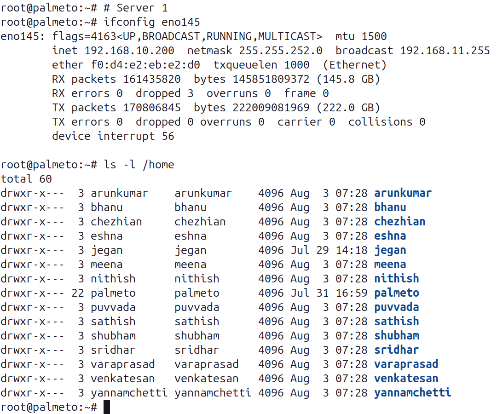
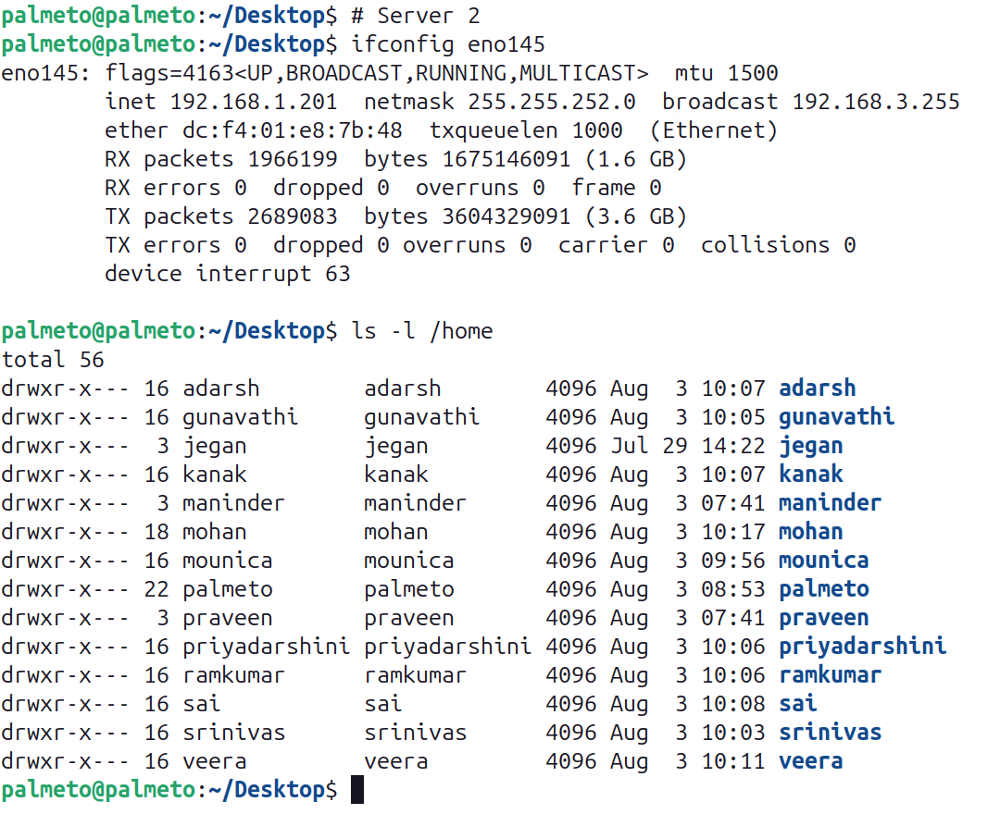

# Red Hat Openshift 03-07 August 2026

## About about lab environment
<pre>
We have got two servers with below configurations
- Dell PowerEdge R840 Server
- Intel Xeon Processor with 192 CPU Cores
- 1 TB RAM
- 21 TB SSD
</pre>

## Server 1 ( IP - 192.168.1.199 )

## Server 2 ( IP - 192.168.1.201 )

